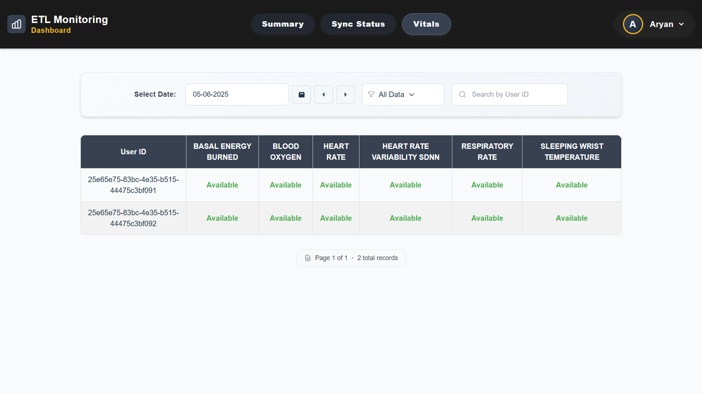

# ETL Monitoring Project

This project is a full-stack ETL Monitoring Dashboard with a React frontend and FastAPI backend. It provides real-time monitoring, analytics, and management for ETL (Extract, Transform, Load) workflows, including user authentication, customizable analytics, and admin user management.

## Tech Stack

### Backend
- **FastAPI**: Modern, fast web framework for building APIs
- **Python 3.8+**: Core programming language
- **MySQL**: Database for user authentication and metadata
- **Delta Lake**: Data storage and processing
- **Pandas & PyArrow**: Data manipulation and processing
- **JWT**: Authentication and authorization
- **Uvicorn**: ASGI server for running FastAPI

### Frontend
- **React**: Frontend library
- **Vite**: Build tool and development server
- **Tailwind CSS**: Utility-first CSS framework
- **DaisyUI**: Component library for Tailwind CSS
- **React Router**: Navigation and routing
- **Axios**: HTTP client for API requests

## Project Setup

### Backend Setup

1. Navigate to the backend directory:
   ```bash
   cd backend
   ```
2. Create and activate a virtual environment:
   ```bash
   python -m venv venv
   # On Windows
   .\venv\Scripts\activate
   # On Unix/MacOS
   source venv/bin/activate
   ```
3. Install Python dependencies:
   ```bash
   pip install -r requirements.txt
   ```
4. Configure the database connection:
   - Create a `.env` file in the backend directory
   - Add the following configuration:
     ```
     MYSQL_HOST=localhost
     MYSQL_USER=your_username
     MYSQL_PASSWORD=your_password
     MYSQL_DATABASE=etl_monitoring
     SECRET_KEY=your_secret_key
     ```
5. Initialize the database:
   - Run the SQL script at `backend/config/setup_database.sql` to create necessary tables and initial setup.
   - If you need to add new fields to the users table (e.g., `nickname`, `full_name`), use the provided migration script if available.
6. Start the backend server:
   ```bash
   uvicorn main:app --reload
   ```
   The API will be available at `http://localhost:8000`

### Frontend Setup

1. Navigate to the frontend directory:
   ```bash
   cd frontend
   ```
2. Install dependencies:
   ```bash
   npm install
   ```
3. Configure API connection:
   - Create a `.env` file in the frontend directory
   - Add the following configuration:
     ```
     VITE_API_URL=http://localhost:8000
     ```
4. Start the development server:
   ```bash
   npm run dev
   ```
   The application will be available at `http://localhost:5173`

## Database & Data Ingestion

- Place your ETL data files (in the required format) in the `backend/data` directory.
- Use the scripts in `backend/data_ingestion/` (e.g., `load_bronze.py`, `run_all_ingestion.py`) to process and load data into Delta Lake tables.
- The backend will read from these tables to provide analytics and monitoring features.

## Application Features

- **User Authentication**: Secure login, password reset, and session management with JWT. Automatic logout on session expiration or authentication errors.
- **Summary/Analytics**: Daily, weekly, and monthly analytics with customizable user settings (e.g., custom user count logic).
- **Sync Status**: Detailed view of ETL sync processes and their statuses for all users.
- **User Vitals**: Monitoring of user/system health metrics and ETL pipeline health.
- **Profile Management**: Update personal info (nickname, full name) and change password from the Profile page.
- **Settings**: Customize analytics logic (user count logic: raw files or custom input) and theme preferences.
- **Admin Panel**: Manage user accounts (add, edit, or remove users) and perform administrative actions (admin access required).
- **Robust Error Handling**: Global error handler for authentication issues and session expiration.
  
  
  
  
  
  
  
  
  

For a detailed walkthrough of all features and usage, see the [USER_GUIDE.md](./USER_GUIDE.md).

## API Documentation

Access the API documentation at:
- Swagger UI: `http://localhost:8000/docs`
- ReDoc: `http://localhost:8000/redoc`

## Development

### Available Scripts

#### Backend
- `uvicorn main:app --reload`: Start development server
- `uvicorn main:app`: Start production server

#### Frontend
- `npm run dev`: Start development server
- `npm run build`: Build for production
- `npm run preview`: Preview production build
- `npm run lint`: Run ESLint

## Contributing

1. Fork the repository
2. Create a feature branch
3. Commit your changes
4. Push to the branch
5. Create a Pull Request

## License

This project is licensed under the MIT License - see the LICENSE file for details.
