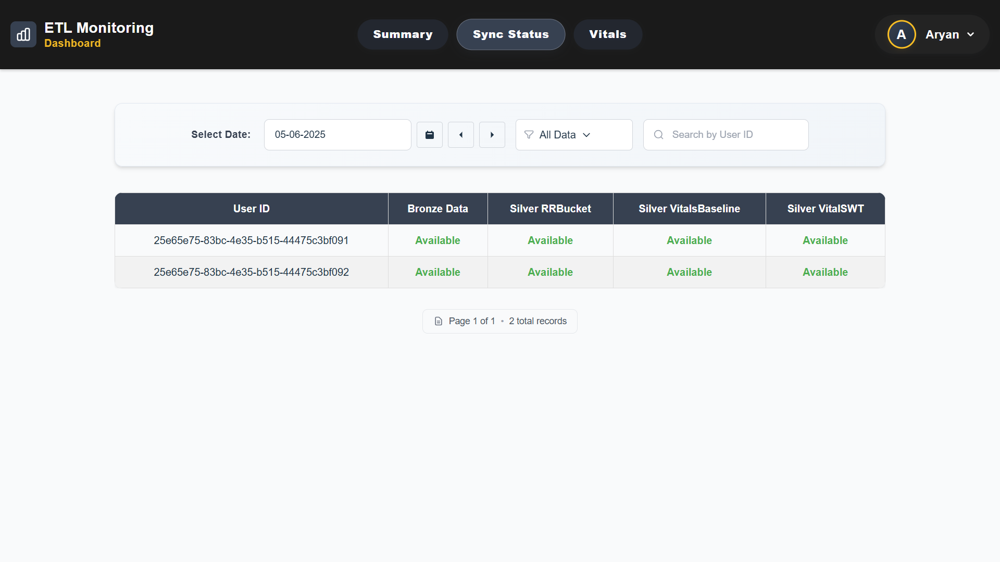
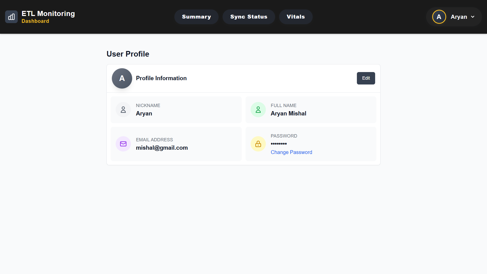

# ETL Monitoring Project

This project is a full-stack ETL Monitoring Dashboard with a React frontend and FastAPI backend. It provides real-time monitoring, analytics, and management for ETL (Extract, Transform, Load) workflows, including user authentication, customizable analytics, and admin user management.

## Tech Stack

### Backend
- **FastAPI**: Modern, fast web framework for building APIs
- **Python 3.8+**: Core programming language
- **MySQL**: Database for user authentication and metadata
- **Delta Lake**: Data storage and processing
- **Pandas & PyArrow**: Data manipulation and processing
- **JWT**: Authentication and authorization
- **Uvicorn**: ASGI server for running FastAPI

### Frontend
- **React**: Frontend library
- **Vite**: Build tool and development server
- **Tailwind CSS**: Utility-first CSS framework
- **DaisyUI**: Component library for Tailwind CSS
- **React Router**: Navigation and routing
- **Axios**: HTTP client for API requests

## Project Setup

### Backend Setup

1. Navigate to the backend directory:
   ```bash
   cd backend
   ```
2. Create and activate a virtual environment:
   ```bash
   python -m venv venv
   # On Windows
   .\venv\Scripts\activate
   # On Unix/MacOS
   source venv/bin/activate
   ```
3. Install Python dependencies:
   ```bash
   pip install -r requirements.txt
   ```
4. Configure the database connection:
   - Create a `.env` file in the backend directory
   - Add the following configuration:
     ```
     MYSQL_HOST=localhost
     MYSQL_USER=your_username
     MYSQL_PASSWORD=your_password
     MYSQL_DATABASE=etl_monitoring
     SECRET_KEY=your_secret_key
     ```
5. Initialize the database:
   - Run the SQL script at `backend/config/setup_database.sql` to create necessary tables and initial setup.
   - If you need to add new fields to the users table (e.g., `nickname`, `full_name`), use the provided migration script if available.
6. Start the backend server:
   ```bash
   uvicorn main:app --reload
   ```
   The API will be available at `http://localhost:8000`

### Frontend Setup

1. Navigate to the frontend directory:
   ```bash
   cd frontend
   ```
2. Install dependencies:
   ```bash
   npm install
   ```
3. Configure API connection:
   - Create a `.env` file in the frontend directory
   - Add the following configuration:
     ```
     VITE_API_URL=http://localhost:8000
     ```
4. Start the development server:
   ```bash
   npm run dev
   ```
   The application will be available at `http://localhost:5173`

## Database & Data Ingestion

- Place your ETL data files (in the required format) in the `backend/data` directory.
- Use the scripts in `backend/data_ingestion/` (e.g., `load_bronze.py`, `run_all_ingestion.py`) to process and load data into Delta Lake tables.
- The backend will read from these tables to provide analytics and monitoring features.

## Application Features

- **User Authentication**: Secure login, password reset, and session management with JWT. Automatic logout on session expiration or authentication errors.
  
  
- **Summary/Analytics**: Daily, weekly, and monthly analytics with customizable user settings (e.g., custom user count logic) and Excel export functionality.
  
  
- **Excel Export**: Export summary reports to Excel format with formatted data, charts, and professional styling for all view types (daily, weekly, monthly).
- **Sync Status**: Detailed view of ETL sync processes and their statuses for all users.
  
  
- **User Vitals**: Monitoring of user/system health metrics and ETL pipeline health.
  
  
- **Profile Management**: Update personal info (nickname, full name) and change password from the Profile page.
  
  
- **Settings**: Customize analytics logic (user count logic: raw files or custom input) and theme preferences.
  
  
- **Admin Panel**: Manage user accounts (add, edit, or remove users) and perform administrative actions (admin access required).
  
  
  
- **Robust Error Handling**: Global error handler for authentication issues and session expiration.

For a detailed walkthrough of all features and usage, see the [USER_GUIDE.md](./USER_GUIDE.md).

## Security & Accessibility Features (v2.5+)

### 🔐 Strong Password Validation System

The application now includes comprehensive password validation to ensure security and prevent common password vulnerabilities.

#### Password Requirements
- **Minimum Length**: 8 characters
- **Maximum Length**: 128 characters
- **Character Types**: Must include uppercase, lowercase, numbers, and special characters
- **Disallowed Characters**: `<`, `>`, `"`, `'`, `&` (for security)
- **Common Password Check**: Blocks 50+ common passwords
- **Sequential Characters**: Warns against obvious patterns (e.g., "123", "abc")

#### Real-time Password Feedback
- **Strength Meter**: Visual indicator showing password strength (very-weak to very-strong)
- **Requirements Checklist**: Real-time validation of password requirements
- **Color-coded Feedback**: Green for met requirements, red for missing requirements
- **Warning System**: Alerts for weak patterns while allowing submission

#### Implementation
- **Frontend**: `frontend/src/utils/passwordValidation.js` - Client-side validation
- **Backend**: `backend/utils/password_validation.py` - Server-side validation
- **Component**: `frontend/src/components/PasswordStrengthIndicator.jsx` - Visual feedback

### 📝 Enhanced Form Accessibility

#### Required Field Indicators
- **Visual Enhancement**: Red asterisks (*) added to all required form fields
- **Consistent Implementation**: Applied across all forms in the application
- **Improved UX**: Clear visual indication of mandatory fields
- **Accessibility**: Screen reader compatible field indicators

### 🚫 404 Error Handling

#### Frontend 404 Page
- **New Component**: `frontend/src/pages/NotFound.jsx`
  - Clean, minimal 404 error page
  - Consistent styling with application theme
  - Two navigation options: "Go to Dashboard" and "Go Back"
  - Responsive design with proper positioning

#### Backend 404 Handler
- **New Feature**: FastAPI 404 exception handler in `backend/main.py`
  - Consistent JSON error responses for invalid API endpoints
  - Proper error message formatting
  - API path information in error responses

### 🔧 Technical Implementation

#### Frontend Integration
- **ForgotPassword.jsx**: Password validation for new password fields
- **Profile.jsx**: Password validation for password change functionality
- **Admin.jsx**: Password validation in user creation/editing forms
- **App.jsx**: Catch-all route for 404 handling

#### Backend Integration
- **Authentication Endpoints**: All password-related endpoints validate password strength
- **Admin Endpoints**: User creation and updates include password validation
- **Error Handling**: Improved error responses with detailed validation messages

## Excel Export Feature

The application now includes a comprehensive Excel export functionality for summary reports. This feature allows users to export their daily, weekly, or monthly summary data to professionally formatted Excel files.

### Features:
- **Multiple View Types**: Export daily, weekly, or monthly summary reports
- **Professional Formatting**: Excel files include proper styling, borders, and color coding
- **Comprehensive Data**: Includes all key metrics, ingestion status, and pipeline status
- **User List**: Exports the complete list of users for the selected period
- **Custom User Settings**: Respects user's custom user count settings in the exported data
- **Automatic Download**: Files are automatically downloaded with descriptive filenames

### How to Use:
1. Navigate to the Summary page
2. Select your desired date and view type (daily/weekly/monthly)
3. Wait for the summary data to load
4. Click the "Export to Excel" button (green button with download icon)
5. The Excel file will be automatically downloaded to your device

### Excel File Contents:
- **Title and Metadata**: Report title, date range, and generation timestamp
- **Key Metrics**: Total raw, bronze, and silver records
- **Ingestion Status**: Total users, successful ingestions, and missing ingestions
- **Pipeline Status**: Raw to Bronze, Bronze to Silver, and overall status with color coding
- **User List**: Complete list of users for the selected period (if available)

### Technical Implementation:
- **Backend**: Uses `openpyxl` library for Excel generation with professional styling
- **Frontend**: Uses `xlsx` library for client-side Excel handling
- **API Endpoint**: `/api/summary/export` with support for different view types
- **File Format**: `.xlsx` format with proper MIME type handling

## API Documentation

Access the API documentation at:
- Swagger UI: `http://localhost:8000/docs`
- ReDoc: `http://localhost:8000/redoc`

## Development

### Available Scripts

#### Backend
- `uvicorn main:app --reload`: Start development server
- `uvicorn main:app`: Start production server

#### Frontend
- `npm run dev`: Start development server
- `npm run build`: Build for production
- `npm run preview`: Preview production build
- `npm run lint`: Run ESLint

## Contributing

1. Fork the repository
2. Create a feature branch
3. Commit your changes
4. Push to the branch
5. Create a Pull Request

## License

This project is licensed under the MIT License - see the LICENSE file for details.

---

**Note:**
The setup instructions above will work provided:
- MySQL is installed, running, and accessible with the credentials you provide in your `.env` files.
- You create the required `.env` files in both the backend and frontend directories as described.
- You install all Python and Node.js dependencies using the provided commands.
- You run the SQL script (`backend/config/setup_database.sql`) to initialize the database before starting the backend server.
- You do not commit your `.env` files or other sensitive information to version control (see the included `.gitignore` files).

If you follow these steps, the project should run successfully on your system.
